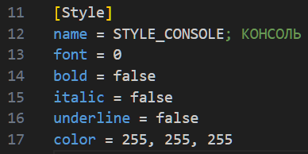
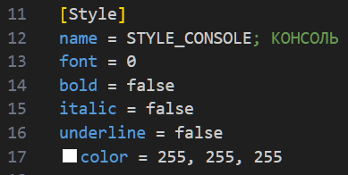

<p align="center">✨Dvurechensky✨</p>

# ⭐ Freelancer Lizerium ⭐ 
## Color Picker INI (VSCode Extension) 😈

- Работает на [VSCode](https://code.visualstudio.com/)
- Простое расширение позволяет в конструкциях формата `color = 255, 255, 255` подсвечивать цвет и добавляет панель выбора цвета слева от каждой подобной строки

* P.s ✌️ Мне пригодилось для файлов `rich_fonts` и во всех файлах игры, где часто такие конструкции использовались

## 💦 Сборка 💦

> Установка всех зависимостей в `Terminal` из корня проекта
```sh
npm install
```

> Сборка проекта (должна появится папка `Out` с итоговым `js` файлом плагина)
```sh
npm run vscode:prepublish
```

> Сборка пакета
```sh
npm install -g vsce
vsce package
```

## 💦 Отладка 💦

1. Переходим в скрипт [extension.ts](src/extension.ts)
2. Запускаем отладку Run->Start Debugging -> VS Code Extension Development 
3. Откроется чистый VS Code который мужно просто пополнить вашим тестовым файлом с конструкциями `color = 255, 255, 255` и смотреть результат показанных на примерах ниже 

### 💦 Пример 💦

---

*`До`* \


---

*`После`* \
 \


<p align="center">✨Dvurechensky✨</p>