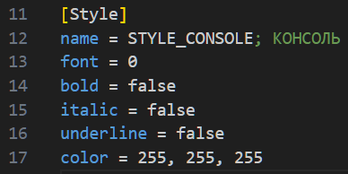
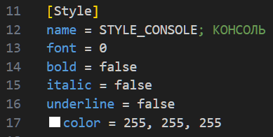
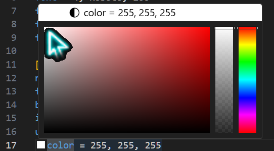

<p align="center">✨Dvurechensky✨</p>

<h1 align="center"> Color Picker INI (VSCode Extension) 😈</h1>
<p align="center"> ⭐ Freelancer <b>Lizerium</b> ⭐ </p>

<div align="center" style="margin: 20px 0; padding: 10px; background: #1c1917; border-radius: 10px;">
  <strong>🌐 Язык: </strong>
  
  <span style="color: #F5F752; margin: 0 10px;">
    ✅ 🇷🇺 Русский (текущий)
  </span>
  | 
  <a href="./README.md" style="color: #0891b2; margin: 0 10px;">
    🇺🇸 English
  </a>
</div>

---

> [!NOTE]
> Этот проект является частью экосистемы **Lizerium** и относится к направлению:
>
> - [`Lizerium.Tools.Structs`](https://github.com/Lizerium/Lizerium.Tools.Structs)
>
> Если вы ищете связанные инженерные и вспомогательные инструменты, начните оттуда.

# ✨ Оглавление

- [✨ Оглавление](#-оглавление)
  - [💦 Описание 💦](#-описание-)
  - [💦 Сборка 💦](#-сборка-)
  - [💦 Отладка 💦](#-отладка-)
    - [💦 Пример 💦](#-пример-)

## 💦 Описание 💦

- Работает на [VSCode](https://code.visualstudio.com/)
- Простое расширение позволяет в конструкциях формата `color = 255, 255, 255` подсвечивать цвет и добавляет панель выбора цвета слева от каждой подобной строки

* P.s ✌️ Мне пригодилось для файлов `rich_fonts` и во всех файлах игры, где часто такие конструкции использовались

## 💦 Сборка 💦

> Установка всех зависимостей в `Terminal` из корня проекта

```sh
npm install
```

> Сборка проекта (должна появится папка `Out` с итоговым `js` файлом плагина)

```sh
npm run vscode:prepublish
```

> Сборка пакета

```sh
npm install -g vsce
vsce package
```

## 💦 Отладка 💦

1. Переходим в скрипт [extension.ts](src/extension.ts)
2. Запускаем отладку Run->Start Debugging -> VS Code Extension Development
3. Откроется чистый VS Code который мужно просто пополнить вашим тестовым файлом с конструкциями `color = 255, 255, 255` и смотреть результат показанных на примерах ниже

### 💦 Пример 💦

---

_`До`_ \


---

_`После`_ \
 \


<p align="center">✨Dvurechensky✨</p>
